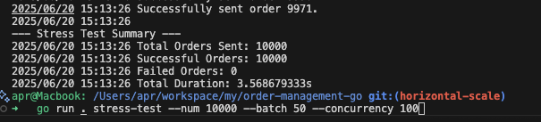

# Order Management Service (Go)

This is a sample order management service built with Go. It provides a RESTful API for creating, reading, updating, and deleting orders. The project is structured following Clean Architecture principles to ensure separation of concerns, maintainability, and testability.

## Project Requirements

The goal is to build an Online Order Management System API that handles concurrent order processing using goroutines and ensures data integrity with PostgreSQL transactions.

### Core Features Checklist

| Requirement | Status | Notes |
| :--- | :--- | :--- |
| **Database Structure** | | |
| `orders` table | ✅ **Done** | The current structure is functional. |
| `order_items` table | ✅ **Done** | The current structure is functional. |
| **API Endpoints** | | |
| `POST /orders` (with items) | ✅ **Done**  | Currently creates an order, but needs logic to handle order items within the same transaction. |
| `GET /orders/{order_id}` |  ✅ **Done** | Needs to be updated to fetch associated order items. |
| `GET /orders` (paginated) | ✅ **Done** | Pagination is implemented. |
| `PUT /orders/{order_id}/status` | ✅ **Done** | This specific endpoint for status updates needs to be created. |
| **Technical Requirements** | | |
| Go Postgres Driver | ✅ **Done** | Using `github.com/jackc/pgx`. |
| Goroutines for Concurrency | ✅ **Done** | A `stress-test` command is available. |
| Transactions for Writes | ✅ **Done** | The repository layer correctly uses transactions. |
| Context Propagation | ✅ **Done** | Context is passed down to the repository for timeout/cancellation handling. |

Result :

---

## Tech Stack

- **Language:** [Go](https://golang.org/)
- **Web Framework:** [Fiber](https://gofiber.io/)
- **Database:** [PostgreSQL](https://www.postgresql.org/)
- **CLI:** [Cobra](https://github.com/spf13/cobra)
- **Configuration:** [Viper](https://github.com/spf13/viper)
- **Containerization:** [Docker](https://www.docker.com/) & [Docker Compose](https://docs.docker.com/compose/)

## Prerequisites

- [Go](https://golang.org/doc/install) (version 1.18 or higher)
- [Docker](https://docs.docker.com/get-docker/)
- [Docker Compose](https://docs.docker.com/compose/install/)

## Getting Started

### 1. Clone the Repository

```bash
git clone <repository-url>
cd order-management-go
```

### 2. Configure the Application

Copy the example configuration file and update it with your database credentials if needed.

```bash
cp config/config.example.yaml config/config.yaml
```

### 3. Start the Database

Run the PostgreSQL database in a Docker container using Docker Compose.

```bash
docker-compose up -d
```

### 4. Run the Application

```bash
go run . http-serve
```

## API Endpoints

| Method | Path | Description |
| :--- | :--- | :--- |
| `POST` | `/api/v1/orders` | Create a new order (with items). |
| `GET` | `/api/v1/orders` | List all orders (paginated). |
| `GET` | `/api/v1/orders/{order_id}` | Get a single order by its ID. |
| `PUT` | `/api/v1/orders/{order_id}/status` | Update an order's status. |
| `DELETE` | `/api/v1/orders/{order_id}` | Delete an order's by it's ID. |

## Stress Testing

This project includes a command to run a stress test against the `CreateOrder` endpoint.

```bash
go run . stress-test --num 1000 --batch 1 --concurrency 50
```

### Flags

- `--num`: The total number of orders to create.
- `--batch`: The number of orders to create in a single batch request.
- `--concurrency`: The number of concurrent workers sending requests.

## Project Structure

- `application/`: Core business logic (domain, services, repositories).
- `cmd/`: CLI commands (Cobra).
- `config/`: Configuration files.
- `infrastructure/`: External concerns (database, HTTP server).
- `main.go`: Main application entry point.
- `init.sql`: Database schema initialization.
- `docker-compose.yaml`: Docker Compose services.

